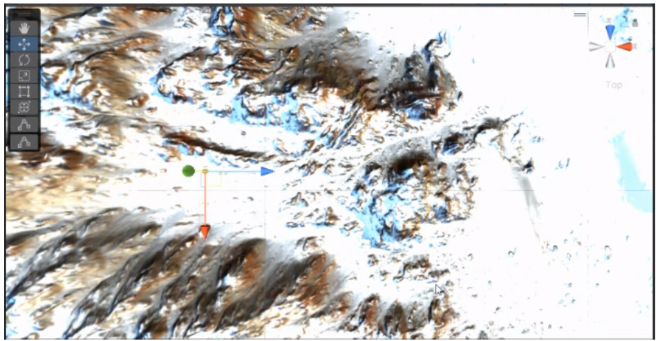

# Snowboard-VR
El proyecto tiene como primer objetivo poder simular un ambiente virtual donde el usuario pueda hacer snowboard. Con el objetivo de  que la sensación sea mucho más real se hará uso de diversas herramientas, el entorno de desarrollo elegido es Unity, la visualización del ambiente se realizará a través Oculus Rift y los movimientos del skate serán captados a través del giroscopio del teléfono, que es colocado en un skate real estacionario.
Como segundo objetivo se decidió enfocarlo a una interacción multijugador, en el cual cada jugador tiene una interacción distinta con el juego. El jugador principal estará en el skate y el segundo jugador llamado Modifier agrega obstáculos al mismo tiempo. Todo es realizado a través del Asset Mirror. 
El último objetivo es realizar una interfaz que permita al usuario poder interactuar con el juego sin necesidad de que un tercero lo ayude. 

